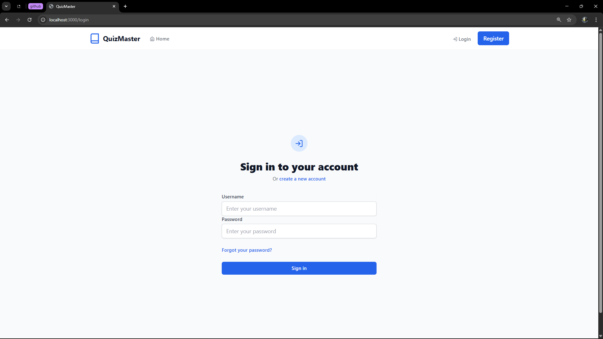
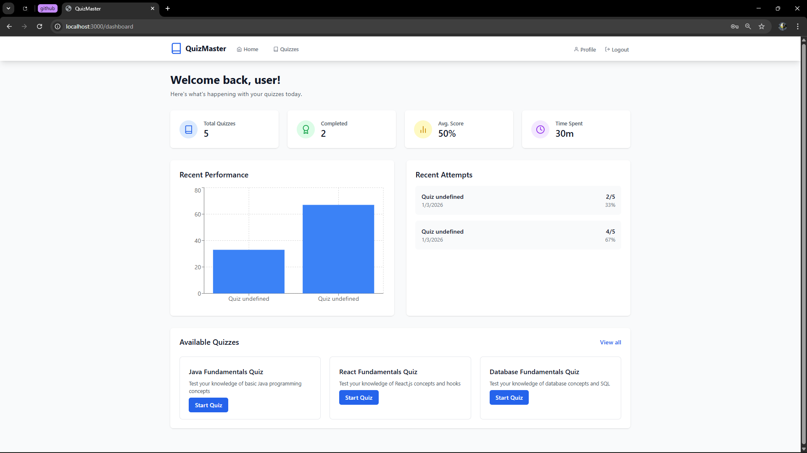
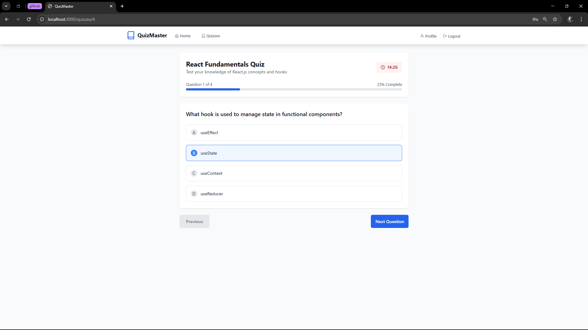
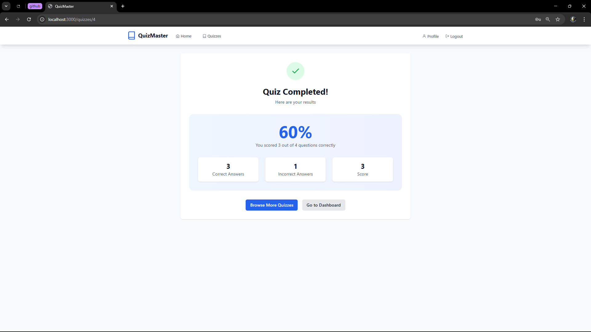
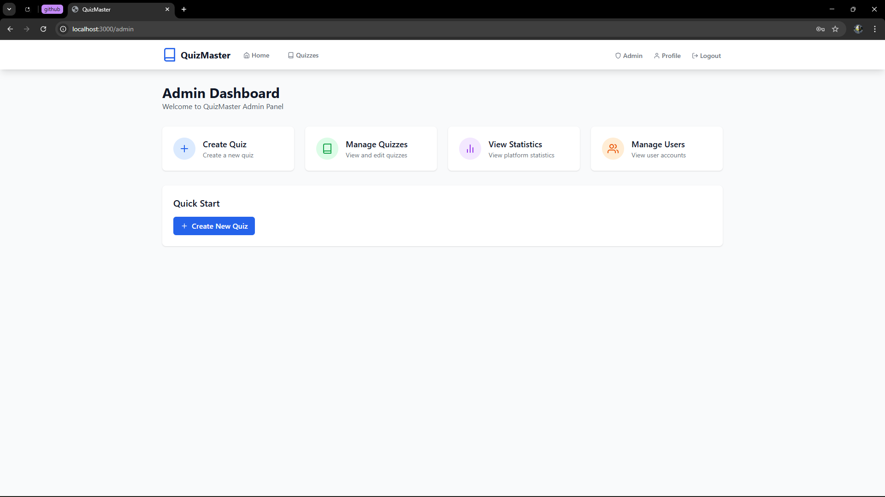
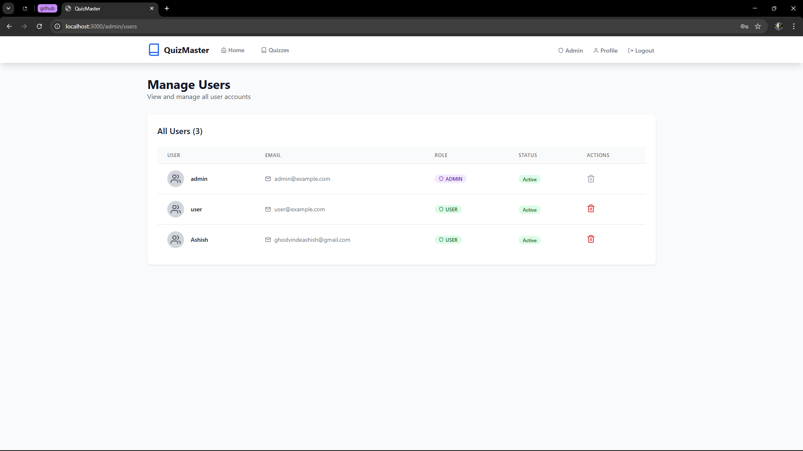
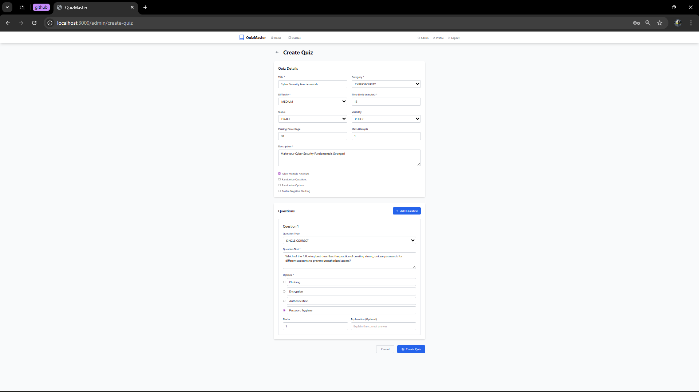

# 🎯 QuizMaster - Interactive Quiz Platform

<div align="center">
  
  
  
</div>

<div align="center">
  <h3>A full-stack quiz application with real-time features and admin dashboard</h3>
</div>

---

## 📋 Table of Contents

- [🚀 Features](#-features)
- [🛠️ Tech Stack](#️-tech-stack)
- [📸 Screenshots](#-screenshots)
- [⚙️ Installation](#️-installation)
- [🎮 Usage](#-usage)
- [👥 User Roles](#-user-roles)
- [ Database Schema](#-database-schema)
- [🤝 Contributing](#-contributing)
- [📄 License](#-license)

---

## 🚀 Features

### 🎯 Core Functionality
- **Interactive Quiz Taking** with real-time timer and progress tracking
- **Multiple Question Types**: Single correct, multiple correct, true/false
- **Instant Results & Feedback** with detailed score breakdown
- **Quiz History & Analytics** for performance tracking

### 👤 User Experience
- **Role-Based Access Control** (Admin/User)
- **JWT Authentication** for secure login
- **Responsive Design** works on all devices
- **Modern UI/UX** with Tailwind CSS

### 🛠️ Admin Features
- **Quiz Management** (Create, Edit, Delete)
- **User Management** with role assignment
- **Real-time Statistics** dashboard
- **Question Bank Management**

---

## 🛠️ Tech Stack

### 🎨 Frontend
- **React 18.2.0** - Modern UI framework
- **Vite** - Fast build tool
- **Tailwind CSS** - Utility-first CSS framework
- **React Router** - Client-side routing
- **Axios** - HTTP client

### 🚀 Backend
- **Spring Boot 3.1.5** - Java framework
- **Spring Security** - Authentication & authorization
- **Spring Data JPA** - Database ORM
- **PostgreSQL 15.0** - Relational database
- **JWT** - Token-based authentication
- **Maven** - Build tool

---

## 📸 Screenshots

### 🏠 Home & Login
<div align="center">
  
  
  <p><em>Welcome screen and secure login interface</em></p>
</div>

### 📊 User Dashboard
<div align="center">
  
  <p><em>Personal dashboard with quiz history and statistics</em></p>
</div>

### 🎮 Quiz Experience
<div align="center">
  
  
  <p><em>Interactive quiz interface and detailed results</em></p>
</div>

### 🛠️ Admin Dashboard
<div align="center">
  
  
  <p><em>Admin control panel and user management</em></p>
</div>

### 📝 Quiz Creation
<div align="center">
  
  <p><em>Intuitive quiz creation interface</em></p>
</div>

---

## ⚙️ Installation

### 📋 Prerequisites
- **Node.js** (v18 or higher)
- **Java** (v17 or higher)
- **Maven** (v3.8 or higher)
- **PostgreSQL** (v15 or higher)

### 🗄️ Database Setup

1. **Create PostgreSQL Database**
   ```sql
   CREATE DATABASE quizmaster;
   CREATE USER quizmaster WITH PASSWORD 'quizmaster123';
   GRANT ALL PRIVILEGES ON DATABASE quizmaster TO quizmaster;
   ```

2. **Or use provided setup script**
   ```bash
   psql -U postgres -f database-setup.sql
   ```

### 🚀 Backend Setup

1. **Navigate to backend directory**
   ```bash
   cd backend
   ```

2. **Configure application properties**
   ```properties
   # backend/src/main/resources/application.properties
   spring.datasource.url=jdbc:postgresql://localhost:5432/quizmaster
   spring.datasource.username=postgres
   spring.datasource.password=your_password
   ```

3. **Run the application**
   ```bash
   mvn spring-boot:run
   ```

### 🎨 Frontend Setup

1. **Navigate to frontend directory**
   ```bash
   cd frontend/quiz-app
   ```

2. **Install dependencies**
   ```bash
   npm install
   ```

3. **Start development server**
   ```bash
   npm run dev
   ```

---

## 🎮 Usage

### 👤 Default Credentials

| Role    | Username | Password |
|---------|----------|----------|
| Admin   | admin    | admin123 |
| User    | user     | user123  |

### 🎯 Quick Start

1. **Open** `http://localhost:3000` in your browser
2. **Login** with admin credentials (`admin/admin123`)
3. **Explore** the admin dashboard and create quizzes
4. **Switch** to user account to test quiz taking
5. **View** results and analytics

---

## 👥 User Roles

### 🔑 Admin Capabilities
- ✅ Create, edit, and delete quizzes
- ✅ Manage user accounts and roles
- ✅ View platform statistics
- ✅ Monitor quiz attempts and performance

### 🎮 User Capabilities
- ✅ Take available quizzes
- ✅ View personal quiz history
- ✅ Track performance statistics
- ✅ Manage profile information

---

## 📊 Database Schema

### 🗂️ Core Tables
```sql
users          ── User accounts and authentication
quizzes        ── Quiz definitions and settings
questions      ── Individual quiz questions
quiz_attempts  ── User quiz attempts and results
```

---

## 🤝 Contributing

1. **Fork** the repository
2. **Create** a feature branch
   ```bash
   git checkout -b feature/amazing-feature
   ```
3. **Commit** your changes
   ```bash
   git commit -m 'Add amazing feature'
   ```
4. **Push** to the branch
   ```bash
   git push origin feature/amazing-feature
   ```
5. **Open** a Pull Request

---

## 📄 License

This project is licensed under the MIT License - see the [LICENSE](LICENSE) file for details.
